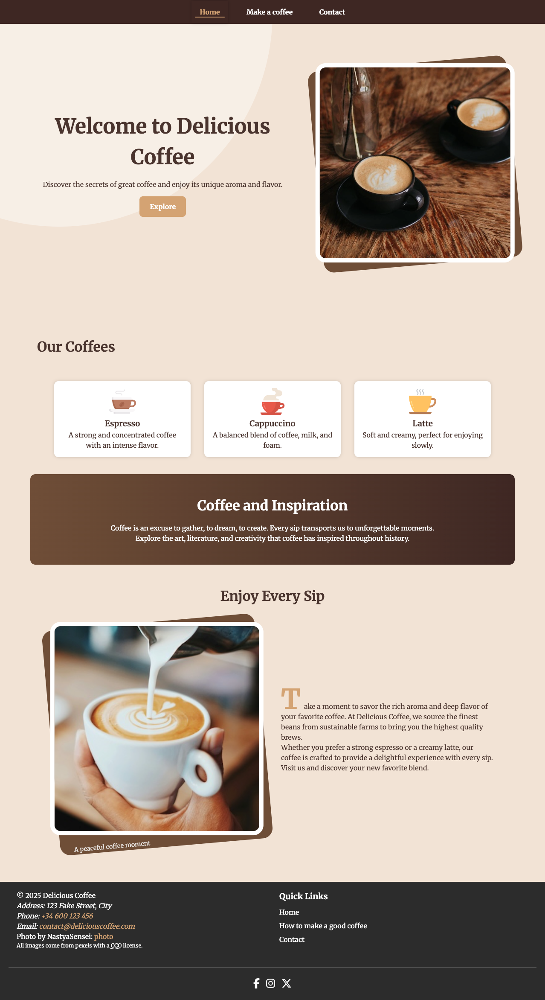
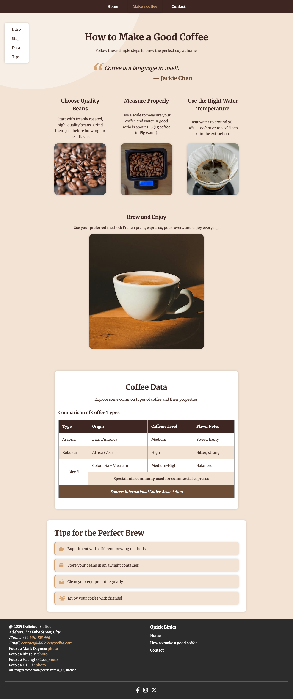
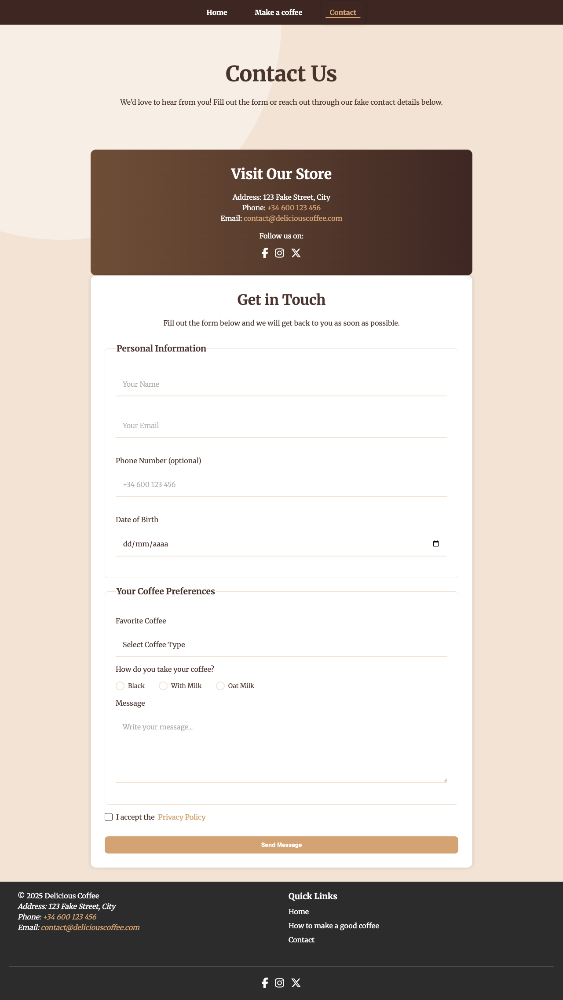

# HTML & CSS

## Shared content

- ### Final Assignment:
The final assignment for this subject consisted of recreating a simple three-page website, strictly following a provided design mockup.

Special attention was required for accessibility considerations and responsive design, as specified in the assignment guidelines.

All the files and code can be found at "PracticaFinal" folder.

Live site:  https://axelsan79.github.io/UOC_html-CSS/index.html

Below are some screenshots of the mockup:

#### *Index Layout*

#### *How Layout*

#### *Contact Layout*

